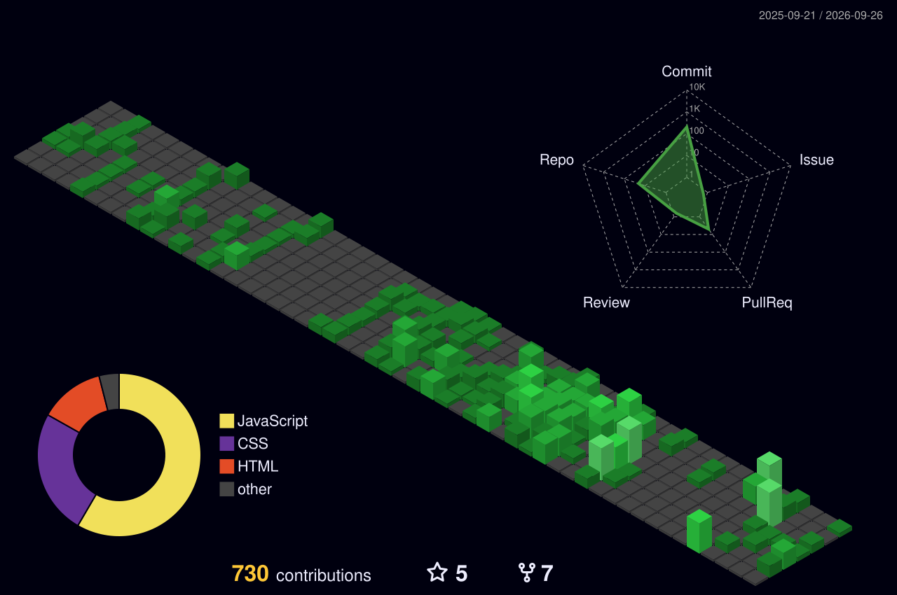

<picture>
  <source media="(prefers-color-scheme: dark)" srcset="./assets/name-dark.svg" />
  <source media="(prefers-color-scheme: light)" srcset="./assets/name-light.svg" />
  
</picture>

 

&nbsp;

 

##  <samp>sobre</samp>

<table>
<tr>
<td valign="middle">

&nbsp;&nbsp; &nbsp;Foco em **interfaces que encantam**

&nbsp;&nbsp; &nbsp;Construindo meu **TCC: um app de caronas solidárias entre estudantes**

&nbsp;&nbsp; &nbsp;Me aprofundando em **React**

&nbsp;&nbsp; &nbsp;Me pergunte sobre **React · TailwindCSS · Figma**

&nbsp;&nbsp; &nbsp;Portfólio: **[em construção]**

&nbsp;&nbsp; &nbsp;Também sou **ilustrador digital**, desenho há quase 10 anos :D

</td>
<td valign="middle" align="center" width="300">

</td>
</tr>
</table>

<!-- Gerado pelo GitHub Action (.github/workflows/3d-contrib.yml). Aparece após o 1º run. -->

<!-- Gerado pelo GitHub Action (.github/workflows/snake.yml). Aparece após o 1º run. -->

##  <samp>stack</samp>

